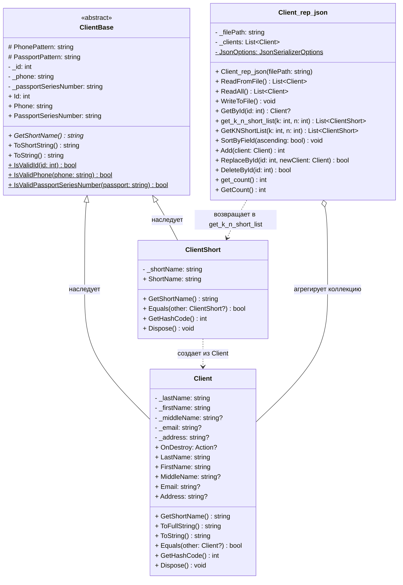

# Диаграмма классов — Лабораторная работа 2

## Пункт 1: Репозиторий Client_rep_json

```mermaid
classDiagram
    direction TB

    class ClientBase {
        <<abstract>>
        # PhonePattern: string
        # PassportPattern: string
        - _id: int
        - _phone: string
        - _passportSeriesNumber: string
        + Id: int
        + Phone: string
        + PassportSeriesNumber: string
        + GetShortName()* string
        + ToShortString() string
        + ToString() string
        + IsValidId(id: int)$ bool
        + IsValidPhone(phone: string)$ bool
        + IsValidPassportSeriesNumber(passport: string)$ bool
    }

    class Client {
        - _lastName: string
        - _firstName: string
        - _middleName: string?
        - _email: string?
        - _address: string?
        + OnDestroy: Action?
        + LastName: string
        + FirstName: string
        + MiddleName: string?
        + Email: string?
        + Address: string?
        + GetShortName() string
        + ToFullString() string
        + ToString() string
        + Equals(other: Client?) bool
        + GetHashCode() int
        + Dispose() void
    }

    class ClientShort {
        - _shortName: string
        + ShortName: string
        + GetShortName() string
        + Equals(other: ClientShort?) bool
        + GetHashCode() int
        + Dispose() void
    }

    class Client_rep_json {
        - _filePath: string
        - _clients: List~Client~
        - JsonOptions: JsonSerializerOptions$
        + Client_rep_json(filePath: string)
        + ReadFromFile() List~Client~
        + ReadAll() List~Client~
        + WriteToFile() void
        + GetById(id: int) Client?
        + get_k_n_short_list(k: int, n: int) List~ClientShort~
        + GetKNShortList(k: int, n: int) List~ClientShort~
        + SortByField(ascending: bool) void
        + Add(client: Client) int
        + ReplaceById(id: int, newClient: Client) bool
        + DeleteById(id: int) bool
        + get_count() int
        + GetCount() int
    }

    ClientBase <|-- Client : наследует
    ClientBase <|-- ClientShort : наследует
    ClientShort ..> Client : создает из Client
    Client_rep_json o-- Client : агрегирует коллекцию
    Client_rep_json ..> ClientShort : возвращает в get_k_n_short_list
```
